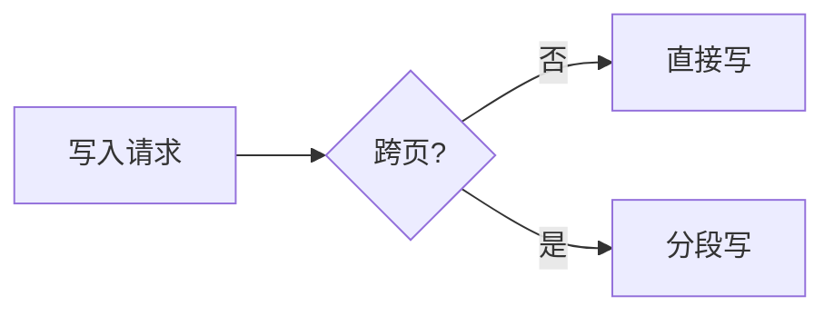

行内代码 `0x3F8` 与行内公式 $E = mc^2$。

## 代码块

```c title="eeprom_write.c"
uint16_t remain = PAGE_SIZE - (addr % PAGE_SIZE);
if (len > remain) {
    eeprom_write_page(addr, buf, remain);
}
```

## Callout

:::tip
提示块：datasheet 里只有一句话。
:::

:::warn
警告块：回卷不会产生任何错误标志。
:::

## 块级公式

$$
f(x) = \int_{-\infty}^{\infty} \hat f(\xi)\, e^{2\pi i \xi x} \, d\xi
$$

## Mermaid



## 表格与引用

| 起始地址 | 长度 | 结果 |
| --- | --- | --- |
| 0x3F0 | 8 | 正常 |
| 0x3F8 | 16 | 页首被覆盖 |

> 所谓「随机」，只是尚未被理解的确定性。
